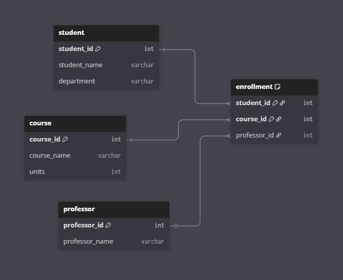

# Golang Campus Database

This is a small [Golang](https://go.dev/) project for our finals in 6DIPROGLANG (Language) and 6IMAN (Database). We decided to make a program based on campus records, featuring students, courses, professors, and enrollments as tables in the database. The database we used is [SQLite](https://sqlite.org/), as it accesses a database locally instead of over a network.

### Getting Started

1. Make sure [Golang](https://go.dev/doc/install) is installed in your local machine.
2. In the CLI, navigate to the directory you wish to clone this repository on.
3. Run `git clone https://github.com/enetwarch/golang-campus-database`.
4. Move to the cloned repository and run `go run .`.

### Database Schema

